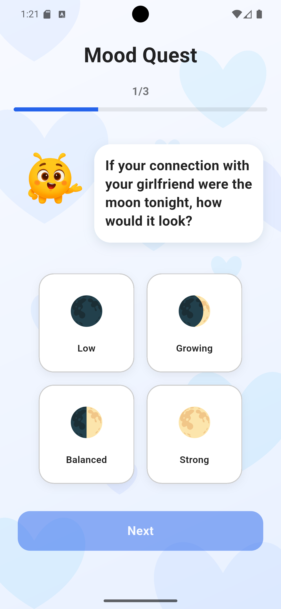
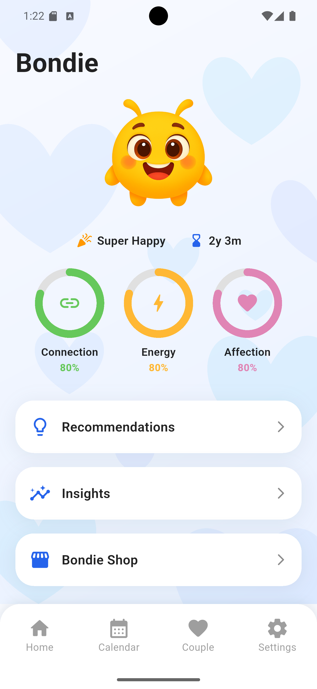
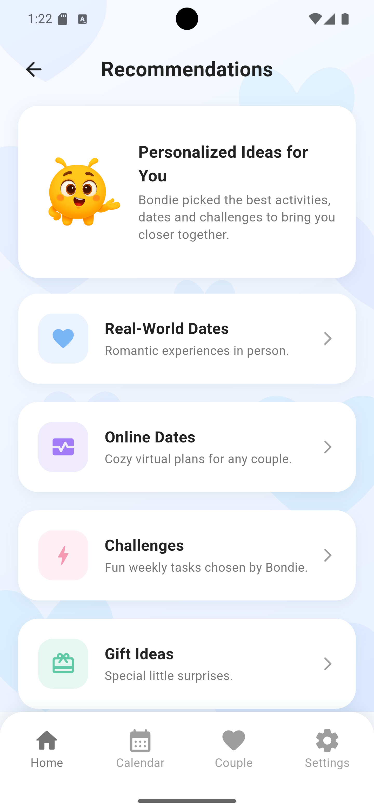
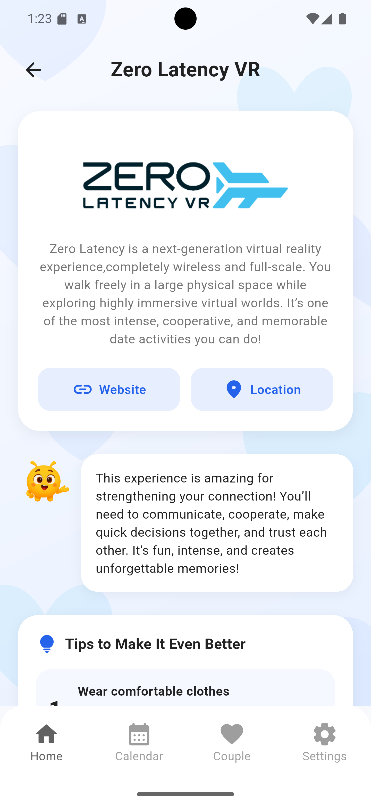
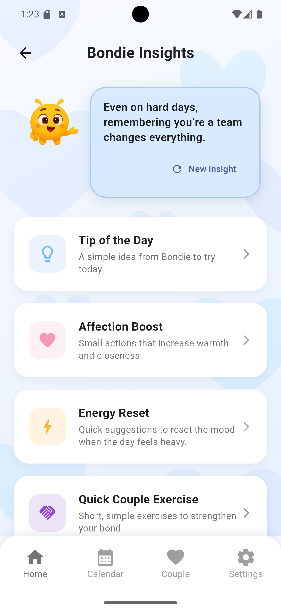
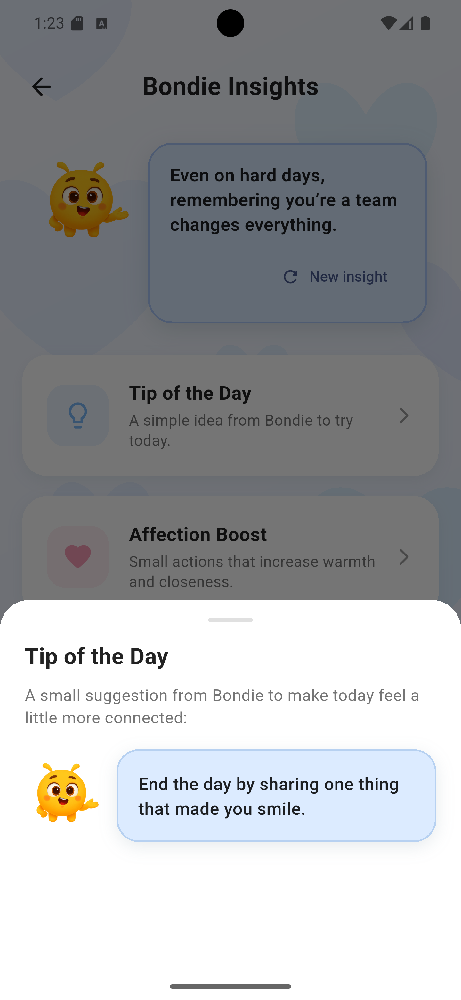
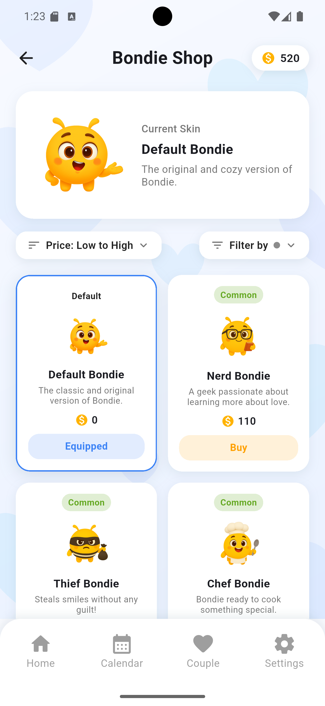
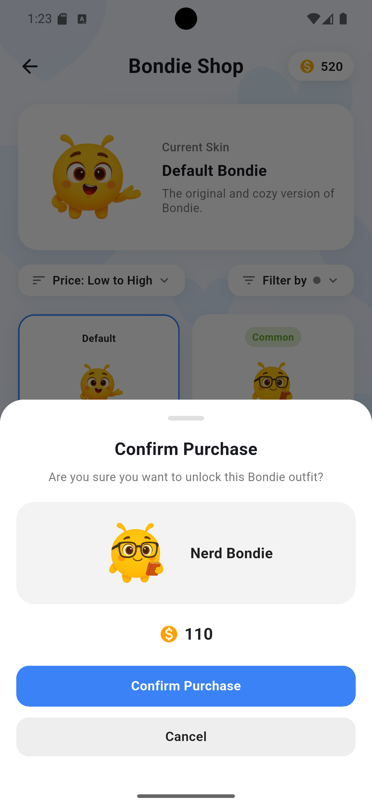
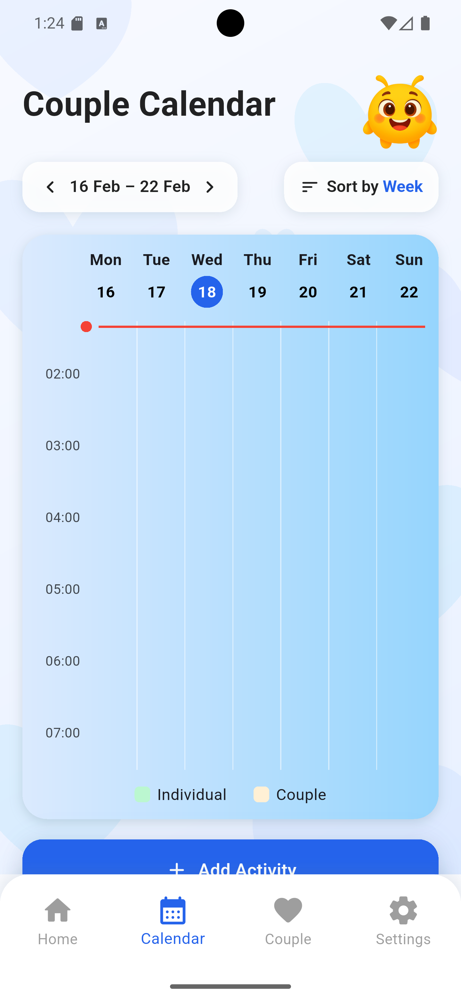
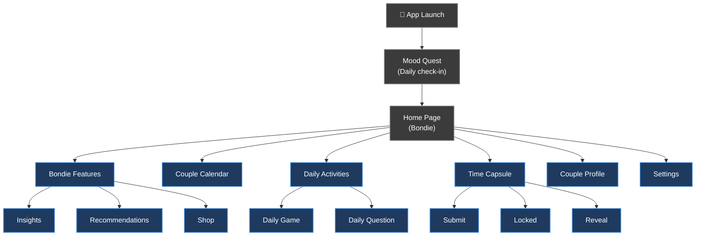

<div align="center">

# Bonded

<p align="center">
  
</p>


### Course - Interação Pessoa-Máquina 2025/2026

*A couples app designed to **strengthen emotional connection** through shared reflections, interactive activities, and personalized guidance.*

</div>

---

## Main Goal

Bonded is a mobile application built with **Flutter & Dart** that helps couples communicate more openly, express emotions, and engage in meaningful shared experiences.

- Shared communication between partners
- Guided emotional awareness through daily activities
- Interactive couple activities and games
- Virtual companion (Bondie) that reflects the couple's bond
- All data is stored locally — privacy first

---

## Features Overview

| Feature | Description |
|---------|-------------|
| 🎭 **Mood Quest** | Daily emotional check-in to personalize the experience |
| 🐝 **Bondie** | Virtual companion offering insights, suggestions & emotional support |
| 📅 **Couple Calendar** | Shared calendar to plan and manage activities together |
| 🎮 **Daily Game** | Quick couple game — compare answers and discover each other |
| ❓ **Daily Question** | Daily question both partners answer and compare |
| ⏳ **Time Capsule** | Monthly capsule with a secret theme, opened at end of month |
| 👥 **Couple Profile** | Shared achievements, statistics, and relationship overview |
| ⚙️ **Settings** | Account preferences, notifications, and app configuration |

---

## Pages & Functionality

### 1. Mood Quest

<p align="center">
  
</p>

The Mood Quest is the **first interaction the user has every day** when opening Bonded. It is a short but meaningful guided questionnaire that captures the user's current emotional state before they dive into the rest of the app.

The questions are carefully designed to be non-intrusive and easy to answer, they cover aspects like how the user is feeling in general, how connected they feel to their partner, and what kind of energy they're bringing into the day. Each answer is recorded and used to build a **live emotional profile** that evolves over time.

The screen is visually calm and welcoming, using smooth transitions between questions and a progress indicator so the user always knows how far along they are. Once completed, the results are saved and the user is taken directly into the home experience.

> 💡 *To complete the Mood Quest again during testing, simply restart the application.*

---

### 2. Bondie

<p align="center">
  
</p>

Bondie is the **emotional core of the Bonded experience**, a virtual companion who lives within the app and accompanies the couple throughout their journey. He is not just a mascot; his visual appearance, mood, and energy directly reflect the **health of the couple's bond**. When the couple is active, engaged, and completing activities together, Bondie thrives. If the couple becomes less engaged, Bondie's state visually deteriorates, acting as a gentle reminder to reconnect.

Bondie is present across most sections of the app and serves as the primary interface for three major feature areas:

#### 2.1. Recommendations

<p align="center">
  
  
  
</p>

The Recommendations section is where Bondie acts as the couple's **personal date and activity planner**. It is divided into four categories, each targeting a different kind of shared experience:

- **Challenges** — Fun couple challenges designed to be completed together, encouraging teamwork, laughter, and spontaneous connection
- **Gift Ideas** — Curated gift suggestions tailored to the couple's profile and interests, helping partners surprise and appreciate each other in meaningful ways
- **Online Dates** — Creative ideas for virtual date nights, perfect for couples in long-distance relationships or those looking for new digital ways to connect
- **Real-World Dates** — Specific real-world location recommendations for in-person dates, complete with descriptions, context, and the ability to directly schedule the outing in the Couple Calendar

> 💡 *In this prototype, only the Real-World Dates category is fully interactive. The other categories are visible but not yet navigable.*

#### 2.2. Insights

<p align="center">
  
  
</p>

The Insights section is where Bondie shares **personalized tips, reflections, and emotional guidance** tailored to the couple's current state. These insights are not generic advice — they are informed by the couple's Mood Quest responses, their activity history, and their overall engagement patterns within the app.

Examples of insights include suggestions on how to communicate more effectively, prompts to reflect on recent shared moments, reminders about emotional patterns, and encouragement during periods of lower engagement. Bondie presents each insight in a conversational, warm tone, making the guidance feel personal rather than prescriptive. Users can scroll through multiple insights and revisit them at any time.

#### 2.3. Shop

<p align="center">
  
  
</p>

The Bondie Shop allows users to **personalize their virtual companion** using coins earned through completing daily activities, games, questions, and other interactions within the app. The shop offers a variety of cosmetic outfits and themed skins for Bondie, each with its own unique visual style.

Purchasing outfits is a rewarding loop that incentivizes daily engagement — the more active the couple is within the app, the more coins they accumulate, and the more they can customize Bondie to reflect their personality and preferences. The selected outfit is applied immediately and persists across the entire app experience.


---

### 📅 Couple Calendar

<p align="center">
  
</p>

The Couple Calendar is the **shared organizational hub** of the Bonded app, giving both partners a unified space to plan, schedule, and track their activities together. It is built on top of the `table_calendar` package and features a fully custom header, footer, and controller system tailored to the app's design language.

The calendar supports **four different view modes** — day, week, month, and year — allowing couples to zoom in on a specific day's schedule or get a high-level overview of their upcoming shared moments. Switching between views is seamless and animated, maintaining context as the user navigates.

Adding a new activity is straightforward: users tap on a date, fill in the activity details (name, time, type, and optional notes), and confirm. Activities can be marked as individual or shared, and both partners can see each other's entries in real time. Editing and deleting events is equally intuitive — tapping an existing event opens a contextual sheet with all edit options readily available.

Over time, the calendar becomes a **visual record of the couple's shared history** — a timeline of dates, events, and milestones that both partners can look back on to celebrate how far they've come together.


---

### 🎮 Daily Game

The Daily Game is one of the two **daily interactive activities** available in Bonded, and it refreshes every 24 hours to keep the experience consistently fresh and engaging. It presents both partners with the same game prompt — a fun, lighthearted, or thought-provoking scenario — and asks each of them to respond independently, without seeing the other's answer first.

The mechanics are simple by design: each partner opens the app, navigates to the Daily Game, and submits their response. The game is structured to be completable in just a few minutes, making it easy to fit into any routine — morning coffee, lunch break, or before bed. The questions span a wide range of tones, from playful hypotheticals ("If you could only eat one food forever, what would it be?") to more meaningful reflections ("What's your favourite memory of us from this year?").

Once both partners have submitted, the app reveals both answers side by side in a clean **comparison view**. This moment of reveal is designed to be engaging — sometimes funny, sometimes touching, and always revealing. Seeing where partners aligned and where they diverged opens up natural conversations that might not have happened otherwise.

Completing the Daily Game rewards both partners with **coins**, which can then be spent in the Bondie Shop. This creates a healthy daily habit loop: couples are incentivized to engage with each other every day in a low-pressure, enjoyable way.

📸 *[Screenshot — Daily Game]*

📸 *[Screenshot — Game Results]*

---

### ❓ Daily Question

The Daily Question is the **second daily activity** in Bonded and complements the Daily Game with a more introspective and emotionally focused format. While the Daily Game leans towards fun and spontaneity, the Daily Question is designed to foster **deeper mutual understanding** between partners by asking questions that encourage genuine reflection.

Each day, a new question is presented to both partners simultaneously — ranging from light and curious ("What's something small that always makes you happy?") to deeper and more meaningful ("What's something you've never told me but wish I knew?"). The question format is deliberately open-ended, allowing each partner to express themselves freely without the constraints of multiple-choice answers.

As with the Daily Game, both partners answer independently without visibility into each other's responses until both have submitted. The **reveal screen** then displays both answers together, formatted clearly for easy comparison. This side-by-side view makes it immediately apparent where the couple's thoughts align and where they diverge — both of which are equally valuable for building connection.

The Daily Question also contributes to the **Couple Profile's mood and insight data**, feeding into the long-term emotional picture that Bondie uses to personalize the app experience. Over weeks and months, the accumulated responses become a rich record of how both partners think, feel, and evolve — a digital journal of their emotional journey together.

Completing the Daily Question, like the Daily Game, rewards both partners with coins to spend in the Bondie Shop.

📸 *[Screenshot — Daily Question]*

📸 *[Screenshot — Question Comparison]*

---

### ⏳ Time Capsule

The Time Capsule is one of Bonded's most **unique and emotionally resonant features**. It operates on a monthly cycle and is designed to create a sense of anticipation, reflection, and surprise — capturing meaningful moments and revealing them at the right time.

**How it works — the three phases:**

**Phase 1 — Opening & Submission (First 2 days of the month)**
At the start of each month, the time capsule opens and reveals a **secret theme** — a curated prompt that gives the couple a shared creative direction for their submissions. Example themes include *"The days you made me smile the most"* or *"A moment I want to remember forever"*. Each partner has a two-day window to submit their entry, which can include photos, videos, and personal notes that relate to the theme. The submissions are private — neither partner can see what the other has submitted until the reveal.

**Phase 2 — Locked (Rest of the month)**
After the two-day submission window closes, the capsule locks and a countdown begins. During this period, neither partner can access or modify their submissions. The locked state is represented visually in the app with a sealed capsule illustration. This intentional delay builds emotional anticipation and gives the submitted content a sense of weight and meaning.

**Phase 3 — Reveal (End of the month)**
When the month ends, the capsule reopens and both partners' submissions are revealed simultaneously. This reveal moment is designed to be a shared experience — seeing each other's photos, videos, and notes side by side, reflecting on the theme together. It becomes a **digital memory artifact** that the couple can revisit at any time, building a growing archive of their relationship's meaningful moments month by month.

> 💡 *During testing, tap the central Bondie illustration to manually simulate the passage of time and progress through the capsule phases. Real-time progression is not active in the prototype.*

> ⚠️ *Inserting actual photos, videos, or notes requires an Android device in developer mode, which is outside the scope of this prototype.*

📸 *[Screenshot — Time Capsule Open]*

📸 *[Screenshot — Time Capsule Submission]*

📸 *[Screenshot — Time Capsule Reveal]*

---

### 👥 Couple Profile

The Couple Profile is the **relationship dashboard** of Bonded — a dedicated space where the couple can see a comprehensive, data-rich overview of their journey together within the app. It is divided into three main sections, each offering a different lens through which to understand and celebrate the relationship.

**Achievements**
The achievements section tracks and displays **milestones and badges** the couple has earned through their activity in the app. These range from simple early milestones (completing the first Mood Quest together, finishing the first Daily Game) to longer-term accomplishments (completing 30 consecutive days of daily activities, filling three Time Capsules, unlocking all Bondie outfits). Achievements serve as a **motivational layer** that rewards consistency and engagement, and they give the couple a tangible sense of progress and shared history.

**Mood Chart**
The mood chart provides a **visual history of the couple's emotional trends** over time, rendered as an interactive graph. It draws from the data collected through the daily Mood Quest responses, allowing both partners to see how their moods have evolved individually and how they compare over days, weeks, and months. Patterns become visible — recurring dips, periods of high connection, and moments of emotional alignment — giving the couple meaningful insight into their emotional rhythm as a unit. This chart is one of the most data-dense features in the app and is designed to spark reflection and conversation.

**Couple Info**
The couple info section displays **key information about both partners and the relationship** — names, profile photos, the date the couple joined Bonded, relationship anniversary, and other relevant details. This section acts as the couple's identity card within the app, grounding the experience in their specific story.

📸 *[Screenshot — Couple Profile]*

📸 *[Screenshot — Mood Chart]*

---

### ⚙️ Settings

The Settings page is the **configuration and account management hub** of Bonded, giving users control over how the app behaves and how their personal data is managed.

From here, users can update their **profile information** — including their name, profile photo, and relationship anniversary date — ensuring that the Couple Profile and other personalized features always reflect accurate, up-to-date details. Account-related actions such as logging out or managing linked partner accounts are also handled here.

The **notification settings** section allows users to customize when and how Bonded reaches out to them. Users can enable or disable reminders for daily activities (Mood Quest, Daily Game, Daily Question), Time Capsule submission deadlines, upcoming calendar events, and new Bondie insights. Fine-grained control over notifications ensures that Bonded feels helpful rather than intrusive, adapting to each user's preferred level of engagement.

General app settings include options for **theme preferences**, language configuration, and data management tools. The settings page is designed to be clean and uncluttered, following the same visual language as the rest of the app, so managing preferences never feels like a chore.

📸 *[Screenshot — Settings]*

---

## System Architecture



---

## Project Structure

```
lib/
└── bondie/
    └── pages/
        ├── actions/
        │   ├── insights/
        │   │   └── bondie_insights_page.dart
        │   └── recommendations/
        │       ├── challenges/
        │       ├── gift_ideas/
        │       ├── online_dates/
        │       └── real_world_dates/
        ├── calendar/
        ├── home/
        ├── mood_quest/
        ├── profiles/
        ├── settings/
        ├── splash_screen/
        └── time_capsule/
            ├── closed/
            ├── opened/
            └── submission/
main.dart
```

---

## Setup & Installation

### Option 1 — Install APK directly

1. Download the `app-release.apk` file
2. Open your phone's Files/Downloads app and locate the APK
3. Tap the APK and allow installation from unknown sources
4. Tap **Install**, then **Open**

### Option 2 — Android Studio + GitHub

```bash
# Clone the repository
git clone https://github.com/Tomasalexpt30/bonded_app.git

# Get dependencies
flutter pub get

# Run the app
flutter run
```

> Requires Flutter SDK 3.19+, Android Studio, and a configured emulator (Pixel 7 recommended).

### Option 3 — Android Studio + ZIP

1. Extract the ZIP file
2. Open Android Studio → `File → Open`
3. Select the extracted folder
4. Run `flutter pub get` and press the green Run button

---

## Technologies

| Technology | Purpose |
|------------|---------|
| **Flutter 3.19+** | Cross-platform UI framework |
| **Dart 3.9** | Core application language |
| **table_calendar** | Calendar grid and event management |
| **flutter_staggered_grid_view** | Responsive grid layouts |
| **photo_view** | Image viewing and zoom |
| **path_provider** | Local file system access |
| **Confetti** | Celebration animations |

---

## Links

- 🔗 **GitHub Repository:** [https://github.com/Tomasalexpt30/bonded_app.git](https://github.com/Tomasalexpt30/bonded_app.git)
- 📥 **Android Studio:** [https://developer.android.com/studio](https://developer.android.com/studio)
- 🐦 **Flutter SDK:** [https://flutter.dev/docs/get-started/install](https://flutter.dev/docs/get-started/install)

---

## Authors

This project was developed as part of the **Interação Pessoa-Máquina** course in the **MSc in Computer Engineering** program at **NOVA School of Science and Technology**.

| Student | Number |
|---------|--------|
| Tomás Alexandre | 73213 |
| Nicolae Iachimovschi | 73381 |

> **Professor:** Teresa Romão | **Lab Class:** 1 | **Group:** 17
